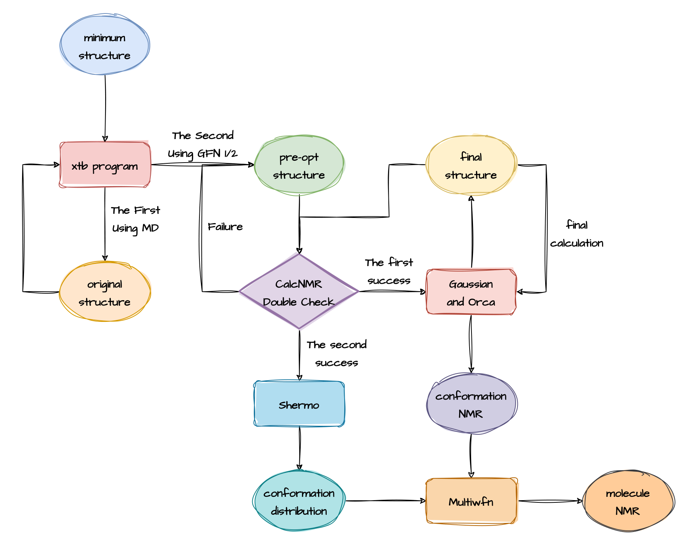

# KYBNMR

NMR calculations have long been the subject of research by chemical researchers. From the 1990s, when DFT (Density Functional Theory) theory was proposed, to the present time, many theoretical chemists have continuously improved the theoretical calculation methods, and NMR Spectrum can also be calculated by DFT theory.

KYBNMR is a scripting program for fully automated calculation of NMR of large molecules by Kimariyb. 

## Ideas for NMR calculations

1. First we need to find out all the possible behaviors of the target molecule in solvent or vacuum. This usually requires a molecular dynamics program for this purpose.
2. Then we need to pre-optimize all the structures found in the previous step using a semi-empirical method and eliminate unreasonable structures as well as duplicates. If there is still too much structure remaining after the previous tasks have been completed, the previous approach can be repeated again using a more advanced semi-empirical approach.
3. The structures selected in the second step are optimized once under a DFT computational program such as Gaussian or Orca, and a single-point task is performed. Repeat step 2 at the same time, eliminating unsuitable and repetitive structures.
4. This can then be used to calculate the Boltzmann distribution of the target molecule at a specific temperature based on the energies (generally the free energy) of the different conformations.
5. Finally, the NMR of the target molecule is obtained by first calculating the NMR of each conformation and then averaging the NMR of all conformations weighted according to the Boltzmann distribution.


## Implementation of NMR calculations

To implement the ideas for NMR calculations, we use the following computational chemistry program: 

- Programs for doing molecular dynamics based on semi-empirical methods: `Xtb`.
- Program for doing pre-optimization of different conformations of molecules: `Xtb`.
- Programs for doing molecular conformation optimization based on DFT theory: `Gaussian`.
- Programs for calculating the energy of molecular conformations: `Orca`.
- Programs for calculating the Boltzmann distribution: `Shermo`.
- Programs for calculating NMR according to the Boltzmann distribution: `Multiwfn`.



## What is the Double Check

Double Check is a kind of check in the KYBNMR program to determine whether the obtained conformation meets the requirements. 

It is called Double Check because there are two criteria that need to be checked when checking these structures. 

The first criterion is to check for the presence of structures that do not make sense, that is, to check for the presence of structures that do not make chemical sense. 

The second criterion is to check whether there is a duplicate structure, for example, the energy difference between some structures is only 0.01 kcal/mol, and this kind of structure is regarded as a duplicate structure.

Double Check helps us to find the structures that satisfy the above two cases, and finally we eliminate these structures and can proceed to the next step of the calculation.

## How to install KYBNMR

**First**, go to the release page and download the compiled KYBNMR and extract it to your linux system.

```shell
unzip kybnmr.zip
```

**Next**, install the necessary programs to run KYBNMR, such as xtb, Gaussian, Orca, and Shermo.

- XTB version: `6.6.0`
- Gaussian version: `C.01` or `A.03`
- Orca version: `5.0.4`
- Shermo version: `2.4.0`

## How to use KYBNMR

Before using KYBNMR, you first need to configure the `config.ini` file.

```ini
[dynamics]
temperature = 400
time = 100.0
dump = 50.0
step = 1.0
hmass = 1
shake = 1
velo = true
nvt = false
sccacc = 2.0
dynamicsArgs = "--omd --gfn 0"

[optimized]
preOptArgs = "--gfn0 --opt normal --niceprint"
postOptArgs = "--gfn2 --opt normal --niceprint --gbsa chcl3"
preThreshold = "0.25, 0.1"
postThreshold = "0.25, 0.1"
gauPath = "/kimariyb/g16/g16"
orcaPath = "/home/kimariyb/orca-5.0.4/orca"
shermoPath = "/home/kimariyb/shermo"
```

- `[dynamics]`: Configuring for dynamics.
  - `temperature`: float, Temperature of dynamic in K.
  - `time`: float, Time of dynamic in ps.
  - `dump`: float, Dump of dynamic in ps.
  - `step`: float, Step of dynamic.
  - `hmass`: int
  - `shake`: int
  - `velo`: bool
  - `nvt`: bool
  - `sccacc`: float
  - `dynamicsArgs`: string
- `[optimized]`: 
  - `preOptArgs`: string
  - `postOptArgs`: string
  - `preThreshold`: string
  - `postThreshold`: string
  - `gauPath`: string
  - `orcaPath`: string
  - `shermoPath`: string

Next you need to prepare an xyz file, which must be used as input to the programme in order to run KYBNMR. 

You can also use `./kybnmr --help` to see the KYBNMR help file. You will see the parameters you can choose to run kybnmr with

```shell
NAME:
   kybnmr - A scripting program for fully automated calculation of NMR of large molecules
USAGE:
   kybnmr [OPTIONS] [command] <input>

AUTHOR:
   Kimari Y.B. <kimariyb@163.com>

COMMANDS:
   help, h  Shows a list of commands or help for one command

OPTIONS:
   --config FILE, -c FILE    Load configuration from FILE (default: "config.ini")
   --opt value, -o value     DFT optimization and vibration procedure (default: 0)
   --sp value, -s value      DFT single point procedure (default: 1)
   --md value, -m value      whether molecular dynamics simulations are performed (default: 1)
   --pre value, --pr value   whether to use crest for pre-optimization (default: 1)
   --post value, --po value  whether to use crest for post-optimization (default: 1)
   --help, -h                show help (default: false)
   --version, -v             print only the version (default: false)

VERSION:
   v1.0.0(dev)
```


## References

- Tian Lu, Qinxue Chen, Shermo: A general code for calculating molecular thermodynamic properties, *Comput. Theor. Chem.*, 1200, 113249 (**2021**) DOI: 10.1016/j.comptc.2021.113249
- Tian Lu, Feiwu Chen, Multiwfn: A Multifunctional Wavefunction Analyzer, *J. Comput. Chem.* 33, 580-592 (**2012**) DOI: 10.1002/jcc.22885
- Tian Lu, Molclus program, Version 1.12, http://www.keinsci.com/research/molclus.html (accessed Aug-23, **2023**)
- C. Bannwarth, E. Caldeweyher, S. Ehlert, A. Hansen, P. Pracht, J. Seibert, S. Spicher, S. Grimme _WIREs Comput. Mol. Sci._, **2020**, 11, e01493. DOI: 10.1002/wcms.1493 
- S. Grimme, C. Bannwarth, P. Shushkov, _J. Chem. Theory Comput._, **2017**, 13, 1989-2009. DOI: 10.1021/acs.jctc.7b00118 
- C. Bannwarth, S. Ehlert and S. Grimme., _J. Chem. Theory Comput._, **2019**, 15, 1652-1671. DOI: 10.1021/acs.jctc.8b01176 
- P. Pracht, E. Caldeweyher, S. Ehlert, S. Grimme, _ChemRxiv_, **2019**, preprint. DOI: 10.26434/chemrxiv.8326202.v1

> There are many more references, too many to list here.

## Thanks

- The developer of Multiwfn, Shermo and Molclus, **Tian Lu**.
- The developer of XTB and Crest, **S. Grimme**.
- The developer of EasyShermo, **Kimari YB, Hsiun Ryan**.

## License

KYBNMR was developed independently by Kimariyb, a master's student at Xiamen University. KYBNMR is open source under the MIT license. This means you are free to use, modify and distribute the code.