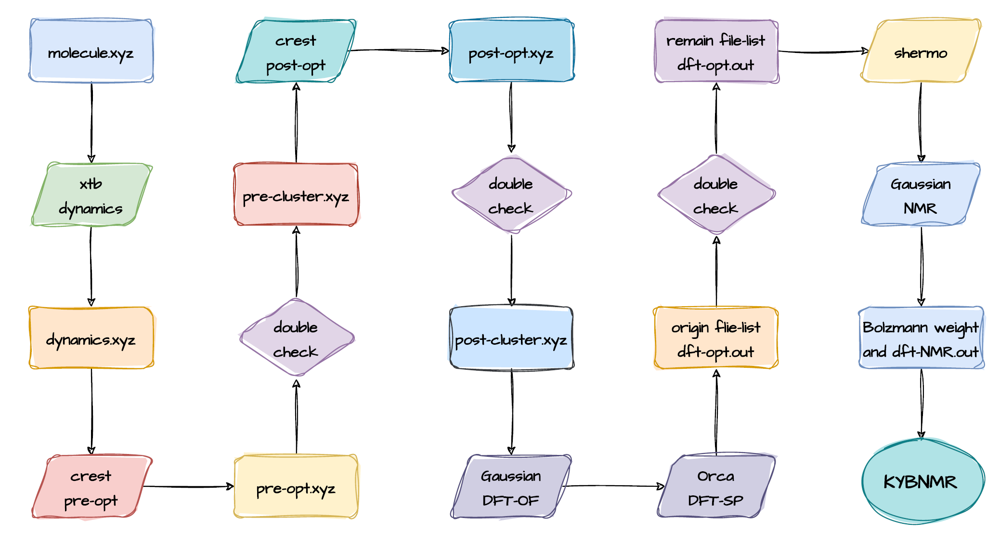

# CalcNMR

NMR calculations have long been the subject of research by chemical researchers. From the 1990s, when DFT (Density Functional Theory) theory was proposed, to the present time, many theoretical chemists have continuously improved the theoretical calculation methods, and NMR Spectrum can also be calculated by DFT theory.

CalcNMR is a scripting program for fully automated calculation of NMR of large molecules by Kimariyb. 

## Ideas for NMR calculations

1. First we need to find out all the possible behaviors of the target molecule in solvent or vacuum. This usually requires a molecular dynamics program for this purpose.
2. Then we need to pre-optimize all the structures found in the previous step using a semi-empirical method and eliminate unreasonable structures as well as duplicates. If there is still too much structure remaining after the previous tasks have been completed, the previous approach can be repeated again using a more advanced semi-empirical approach.
3. The structures selected in the second step are optimized once under a DFT computational program such as Gaussian or Orca, and a single-point task is performed. Repeat step 2 at the same time, eliminating unsuitable and repetitive structures.
4. This can then be used to calculate the Boltzmann distribution of the target molecule at a specific temperature based on the energies (generally the free energy) of the different conformations.
5. Finally, the NMR of the target molecule is obtained by first calculating the NMR of each conformation and then averaging the NMR of all conformations weighted according to the Boltzmann distribution.

## Implementation of NMR calculations

To implement the ideas for NMR calculations, we use the following computational chemistry program: 

- Programs for doing molecular dynamics based on semi-empirical methods: `Xtb`.
- Program for doing pre-optimization of different conformations of molecules: `Xtb`.
- Programs for doing molecular conformation optimization based on DFT theory: `Gaussian`.
- Programs for calculating the energy of molecular conformations: `Orca`.
- Programs for calculating the Boltzmann distribution: `Shermo`.
- Programs for calculating NMR according to the Boltzmann distribution: `Multiwfn`.

## What is the Double Check

Double Check is a kind of check in the CalcNMR program to determine whether the obtained conformation meets the requirements. 

It is called Double Check because there are two criteria that need to be checked when checking these structures. 

The first criterion is to check for the presence of structures that do not make sense, that is, to check for the presence of structures that do not make chemical sense. 

The second criterion is to check whether there is a duplicate structure, for example, the energy difference between some structures is only 0.01 kcal/mol, and this kind of structure is regarded as a duplicate structure.

Double Check helps us to find the structures that satisfy the above two cases, and finally we eliminate these structures and can proceed to the next step of the calculation.

## How to install CalcNMR

## How to use CalcNMR

## Why we need CalcNMR

## References

- Tian Lu, Qinxue Chen, Shermo: A general code for calculating molecular thermodynamic properties, *Comput. Theor. Chem.*, 1200, 113249 (**2021**) DOI: 10.1016/j.comptc.2021.113249
- Tian Lu, and Chen, F. (2012), Multiwfn: A multifunctional wavefunction analyzer. *J. Comput. Chem.*, 33: 580-592. https://doi.org/10.1002/jcc.22885
- Tian Lu, Molclus program, Version 1.12, http://www.keinsci.com/research/molclus.html (accessed Aug-23, **2023**)
- More than ..........